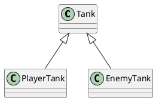

# 面向对象概述
## 为什么要学习面向对象
1.为什么要讲面向对象开发带来的契机
js语言没有类型检查，如果使用面向对象的方式开发，会产生大量的接口，而大量的接口会导致调用复杂度剧增，这种复杂度必须通过严格的类型检查避免错误，尽管可以是使用注释或文档记忆力，但是他们没有强约束力

TS带来了完整的类型系统，因此开发复杂程序时，无论接口数量多少，都可以获取完整的类型检查，并且这种检查是具有强约束力的。

2.面向对象中许多非常熟悉的模式，能处理复杂问题
再过去的很多年中，在大型应该用或复杂领域，面向对象已经积累了非常多的经验
nest.js：相当于前端的java spring
typeorm: ORM框架，比如：mongoose，类似C# EF

## 什么是面向对象
面向对象：Oriented（基于） Object，简称OO
- 是一种编程思想，它提出一切对象对切入点思考问题

其他编程思想：面向过程，函数式编程

面向过程：以功能流程为思考切入点，不太适合大型应该用

函数式编程：以数学运算为思考切入点 
类：可以产生对象的模板
面向对象：划分类为切入点。类最小的功能单元

# 类的继承
## 继承的作用
继承可以描述类与类之间的关系

> 坦克、玩家坦克、敌方坦克
> 玩家坦克是坦克，敌方坦克是坦克

如果A和B都是类，并且可以描述A是B，则A和B形成继承关系：

- B是父类，A是子类
- B派生A，A继承B
- B是A的基类

如果A继承自B，则A中自动拥有B中的所有成员


## 成员的重写
重写（override）：子类中覆盖父类的成员

子类成员不能改变父类成员的类型

无论是属性还是方法，子类都可以对父类的相应成员进行重写，但是重写时，需要保证类型的匹配

注意this关键字：在继承关系中，this的指向是动态——调用方法时，根据具体的调用者确定this的指向
```bash
export class Tank {
  x: number | string = 0
  y: number = 0
  name: string = '坦克'
  shoot (zidanSpeed: number) {
    console.log('发射子弹')
  }
}

export class PlayerTank extends Tank {
  x: string = '11'
  y: number = 20
  name: string = '玩家坦克'
  shoot() {
    console.log('玩家坦克发射子弹')
  }
}

export class EnemyTank extends Tank {
  shoot() {
    console.log('敌方坦克发射子弹')
  }
} 

const palyerTank = new PlayerTank()
console.log(palyerTank.x, palyerTank.y)
palyerTank.shoot()
```

super关键字：在子类的方法中，可以使用super关键字读取父类成员

## 类型匹配
鸭子辨型法
子类的对象，始终可以赋值父类
面向对象中，这种现象，叫做里氏替换原则
如果需要判断一个数据的具体子类类型，可以使用`instanceof`

## protected修饰符
redonly: 只读修饰符
访问权限修饰符：private、public、protected
protected: 受保护的成员，只能在自身和子类中访问

## 单根性和传递性
单根性：每个类最多只能拥有一个父类
传递性：如果A是B的父类，并且B是C的父类，则，可以认为A也是C的父类

# 抽象类
## 为什么需要抽象类
有事，某个类只表示一个抽象概念，主要用于提取子类共有成员，而不能直接创建它对象，该类可以作为抽象类。
给类前面加上 `abstract`，表示该类是一个抽象类，不可以创建一个抽象类的对象，
```bash
# 抽象类
abstract class Chess {
  
}
class Horse extends Chess {

}

const h = new Horse()
const chess = new Chess() # 报错
```
## 抽象成员
父类中，可能知道有些成员是必须存在的，但是不知道该成员的值或实现是什么，因此，需要有一种强约束，让继承该类的子类，必须要实现该成员。
**抽象类中**，可以有抽象成员，这些抽象成员必须在子类实现
```bash
# 抽象类
abstract class Chess {
  x: number = 0;
  y: number = 0
  abstract readonly name: string; # 抽象成员
}
class Horse extends Chess {
  readonly name: string = "马"
}
class Pao extends Chess {
  name: string;
  constructor () {
    super();
    this.name = '炮'
  }
}
class Soldier extends Chess {
  get name () {
    return '兵'
  }
}
const h = new Horse()
const p = new Pao();
const s = new Soldier();
```

## 设计模式 - 模板模式
设计模式：面对一些常见的功能场景，有一些固定的、经过多年实践的成熟方法，这些方法称之为设计模式

模板模式：有些方法，所有的子类实现的流程完全一致，只是流程中的某个步骤具体实现不一致，可以将该方法提取到父类，在父类中完成整个流程的实现，遇到实现不一致的方法时，将该方法做成功抽象方法
```bash
# 抽象类
abstract class Chess {
  x: number = 0;
  y: number = 0
  abstract readonly name: string;
  move(targetX: number, targetY: number): boolean {
    console.log('1.边界判断')
    console.log('2.目标位置是否有己方棋子')
    # 3.规则判断
    if (this.rule(targetX, targetY)) {
      this.x = targetX
      this.y = targetY
      return true
    }
    return false
  }
  protected abstract rule(targetX: number, targetY: number): boolean
}
class Horse extends Chess {
  move(targetX: number, targetY: number): boolean {
    console.log('1.边界判断')
    console.log('2.目标位置是否有己方棋子')
    console.log('3.棋子移动规范判断')

    console.log('马移动成功')
    return true;
  }
  readonly name: string = "马"
}
```

# 静态成员
## 什么是静态成员
静态成员是指，附着在类上的成员（属于某个构造函数的成员）
使用static修饰的成员，是静态成员
实例成功：对象成员，属于某个类的对象
静态成员：非实例成员
```bash
class User {
  constructor (
    public loginId: string,
    public loginPwd: string,
    public name: string,
    public age: number
  ) {}
  static login(loginId: string, loginPwd: string): User | undefined {
    return undefined
  }
}
User.login('xxx', 'ddd')
```

## 静态方法中的this
实例方法中的this指向的是*当前对象*
而静态方法中的this指向的是*当前类*

## 设计模式 - 单例模式
单例模式：某些类的对象，在系统的对象，在系统中最多只能有一个，为了避免开发者早餐随意创建多个类对象的错误，可以使用单例模式进行强约束
```bash
class Board {
  width: number = 500;
  height: number = 700;
  init () {
    console.log('初始化棋盘')
  }
  private constructor () {}
  private static _board?: Board

  static createBoard (): Board {
    if (this._board) {
      return  this._board
    } 
    this._board = new Board();
    return this._board;
  }
}
const b = Board.createBoard();
const c = Board.createBoard();
console.log(b === c)
```
```bash

class Board {
  width: number = 500;
  height: number = 700;
  init () {
    console.log('初始化棋盘')
  }
  private constructor () {}
  static readonly  singleBoard = new Board()
}

const b = Board.singleBoard;
const c = Board.singleBoard;
console.log(b === c)
```

# 再谈接口
接口用于约束类、对象、函数，是一个类型契约
> 有一个马戏团，马戏团有很多动物，包括：狮子、老虎、猴子、狗，这些动物都具有共用的特征：名字、年龄、种类名称，还包含一个共同方法：打招呼，他们各自有各自的技能，技能是可以通过顺利改变的。狮子老虎能够进行火圈表演，猴子能进行平衡表演，狗能进行智慧表演   

> 马戏团中有以下常见的技能：

> - 火圈表演：单火圈、双火圈
> - 平衡表演：独木桥、走钢丝
> - 智慧表演：算术题、跳舞 

不使用接口实现时：
- 对能力没有强约束力
- 容易将类型和能力耦合在一起

系统中缺少对能力的定义 —— 接口
面向对象领域中接口的语义：表达了某个类是否拥有某种能力
某个类具有某种能力，其他，就是实现某种接口 
类型保护函数：通过调用该函数，会触发TS的类型保护，该函数必须返回boolean
> 接口可以继承类，表示该类的所有成员都在接口中
```bash
class A {
  a1: string = ''
  a2: string = ''
  a3: string = ''
}
class B {
  b1: number = 0;
  b2: number = 0;
  b3: number = 0;
}
interface C extends A, B {}
const c: C = {
  a1: '1213',
  a2: '2222',
  a3: '33333',
  b1: 0,
  b2: 3,
  b3: 1
}
```
## 一般思维代码
```bash
# animals.ts
export abstract class Animal {
  abstract type: string
  constructor (
    public name: string,
    public age: number
  ) {}
  sayHello () {
    console.log(`各位观众，大家好，我是${this.type}, 我叫${this.name},今年${this.age}岁`)
  }
}

export class Lion extends Animal {
  type: string = '狮子'
  singleFire() {
    console.log(`${this.name}进行单火圈`)
  }
  doubleFire() {
    console.log(`${this.name}进行双火圈`)
  }
}

export class Tiger extends Animal {
  type: string = '老虎'
  singleFire() {
    console.log(`${this.name}进行单火圈`)
  }
  doubleFire() {
    console.log(`${this.name}进行双火圈`)
  }
}
export class Monkey extends Animal {
  type: string = '猴子'
  dumuqiao () {
    console.log(`${this.name}进行独木桥`)
  }
  tightropeWalking () {
    console.log(`${this.name}进行走钢丝`)
  }
}
export class Dog extends Animal {
  type: string = '狗 '
  arithmeticProblem () {
    console.log(`${this.name}做算术题`)
  }
  dancing () {
    console.log(`${this.name}跳舞`)
  }
}

# index.ts
import {Animal, Lion, Tiger, Monkey, Dog} from './animals';

const animals: Animal[] = [
  new Lion('王富贵', 12),
  new Tiger('坤坤', 21),
  new Monkey('小六', 3),
  new Dog('旺财', 3),
  new Dog('狗剩', 5)
]
# 1.所有动物打招呼
animals.forEach(a => a.sayHello());
# 2.所有进行火圈表演的动物，完成火圈表情
animals.forEach (a => {
  if (a instanceof Lion) {
    a.singleFire();
    a.doubleFire();
  } else if (a instanceof Tiger) {
    a.singleFire();
    a.doubleFire();
  }
})
```

## 晋升代码
### 入口文件 index.ts
```bash
import {Animal, Lion, Tiger, Monkey, Dog} from './animals';
import { IFireShow, WisdomShow } from './interfaces';

const animals: Animal[] = [
  new Lion('王富贵', 12),
  new Tiger('坤坤', 21),
  new Monkey('小六', 3),
  new Dog('旺财', 3),
  new Dog('狗剩', 5)
]
# 1.所有动物打招呼 
animals.forEach(a => a.sayHello());
# 2.所有进行火圈表演的动物，完成火圈表情

function hasFireShow (ani: Object): ani is IFireShow {
  if ((ani as unknown as IFireShow).singleFire && (ani as unknown as IFireShow).doubleFire) {
    return true
  }
  return false
}

animals.forEach (a => {
  if (hasFireShow(a)) {
    a.singleFire();
    a.doubleFire() 
  }
})

# 3.所有平衡表演的动物，完成平衡表演
function hasWisdomShow (ani: Object): ani is WisdomShow{
  if ((ani as unknown as WisdomShow).dumuqiao && (ani as unknown as WisdomShow).tightropeWalking) {
    return true
  }
  return false
}

animals.forEach (a => {
  if (hasWisdomShow(a)) {
    a.dumuqiao();
    a.tightropeWalking() 
  }
})
```
### 接口模块 interfaces.ts
```bash
# 火圈表演：单火圈、双火圈
export interface IFireShow {
  singleFire(): void;
  doubleFire(): void;
}

# 平衡表演：独木桥、走钢丝
export interface WisdomShow {
  dumuqiao(): void;
  tightropeWalking(): void
}


# 智慧表演：算术题、跳舞 
export interface BalanceShow {
  arithmeticProblem(): void;
  dancing(): void;
}
```

### 动物class类 animals.ts
```bash
import {IFireShow, WisdomShow, BalanceShow} from './interfaces'

export abstract class Animal {
  abstract type: string
  constructor (
    public name: string,
    public age: number
  ) {}
  sayHello () {
    console.log(`各位观众，大家好，我是${this.type}, 我叫${this.name},今年${this.age}岁`)
  }
}

export class Lion extends Animal{
  type: string = '狮子'
  singleFire() {
    console.log(`${this.name}进行单火圈`)
  } 
  doubleFire() {
    console.log(`${this.name}进行双火圈`)
  }
}

export class Tiger extends Animal implements IFireShow {
  type: string = '老虎'
  singleFire() {
    console.log(`${this.name}进行单火圈`)
  }
  doubleFire() {
    console.log(`${this.name}进行双火圈`)
  }
}
export class Monkey extends Animal implements WisdomShow {
  type: string = '猴子'
  dumuqiao () {
    console.log(`${this.name}进行独木桥`)
  }
  tightropeWalking () {
    console.log(`${this.name}进行走钢丝`)
  }
}
export class Dog extends Animal implements BalanceShow {
  type: string = '狗 '
  arithmeticProblem () {
    console.log(`${this.name}做算术题`)
  }
  dancing () {
    console.log(`${this.name}跳舞`)
  }
}
```

# 索引器
`对象[值]`,使用成员表达式
```bash
const methodName = 'sayHello'
class User {
  constructor (
    public name: string,
    public age: number
  ) {}
  [methodName] () {

  }
}
const u = new User('123', 123);
u[methodName]()
```
在Ts中，在默认情况下，不对索引器（成员表达式）做严格的类型检查
可配置`"noImplicitAny": true,`开启隐式any的检查
隐式any：TS根据实际情况导出的angy类型
在索引器中，键的类型可以是字符串，也可以是数字
索引器在类中书写的位置应该是所有成员之前
TS索引器的作用
- 在严格的检查下，可以实现为类动态增加成员
- 可以实现动态的操作类成员

在js中，所有成员名本质上，都是字符串，如果使用数字作为成员名，会自动转换为字符串。
在TS中，如果某个类中使用了两种类型的索引器，要求两种索引器的值类型必须匹配          

```bash
class User {
  [prop: string]: any
  constructor (
    public name: string,
    public age: number
  ) {}
  sayHello() {}
}
const u = new User('123', 123);
u["name"]
```

```bash
class MyArray {
  [index: number]: any
  0 = '1'
  1 = 'asdfa'
  3 = 'dfsafasf'
}

const my = new MyArray();
my[5] # 不会报错
```

# this的指向约束
## 在js中this指向的几种情况

- 如果直接调用函数（全局调用），this指向全局对象或者undefined（启用严格模式）
- 如果使用`对象.方法`调用，this指向对象本身
- 如果是dom事件处理的函数，this指向事件处理对象

特殊情况：
- 箭头函数，this在函数声明时确定指向，指向函数位置this
- 使用bind、apply、call手动绑定this对象

## TS中this
配置` "noImplicitThis": true`表示不允许this隐式指向any
```bash
interface IUser {
  name: string,
  age: number,
  sayHello(this: IUser): void # 这不是参数，约定this的指向
}

const u: IUser = {
  name: 'ssf',
  age: 123,
  sayHello () {
    console.log(this.name, this.age);
  }
}
```